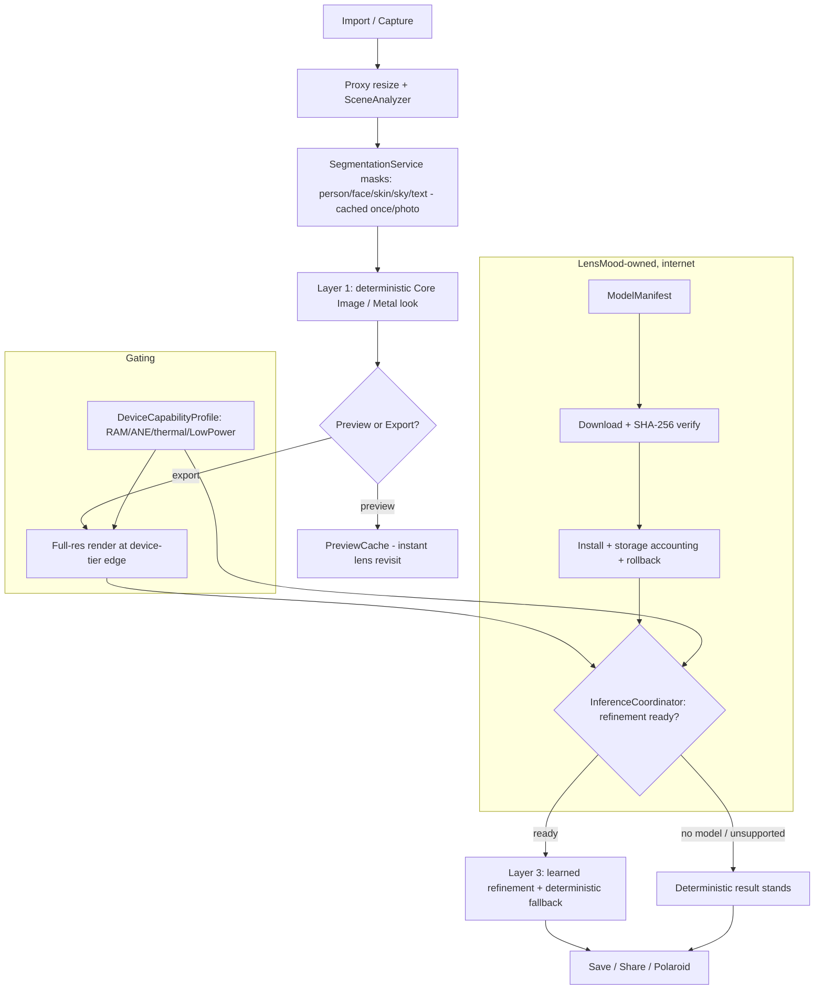

# LensMood On-Device AI — R60 Delivery Report

Maps the mandate's 24 required deliverables to what was built this round. The
honest split: the **architecture, delivery seam, device tiers, masks, caching,
evaluation, and Layer-3 scaffold are implemented and CI-verified**; the numbers
that require **real iPhone hardware** (benchmarks, memory, thermal) and the
**trained learned model** (needs a dataset + Mac training + device validation)
are deferred by the agreed scope, with the instruments to produce them in place.
No fabricated measurements appear here.

## Architecture (Deliverable #2)

Layer 1 (deterministic) is the primary path and remains 100% of today's shipping
render. Layer 2 (Apple Vision masks) is wired and cached. Layer 3 (learned) is
scaffolded, fallback-first, and off until a validated model ships.

## Deliverables checklist

| # | Deliverable | Status |
|---|---|---|
| 1 | Technical audit | ✅ `docs/ON_DEVICE_AI_AUDIT.md` |
| 2 | Revised architecture | ✅ above + this report |
| 3 | Model-delivery architecture | ✅ `ModelDelivery.swift` (registry/verify/install/storage/rollback) |
| 4 | Final Lens schema | ✅ `Lens.swift` + `LensCatalog.swift` (all 18) |
| 5 | Files changed | ✅ this section, below |
| 6 | Benchmarks by device | ⏸ harness shipped (`PerformanceBenchmarks`); run on device to fill |
| 7 | Peak-memory measurements | ⏸ real Mach `phys_footprint` probe shipped; device run pending |
| 8 | Download-size measurements | ⏸ descriptor carries `downloadBytes`; N/A until a model exists |
| 9 | Installed model-size | ⏸ registry accounts `installedBytes`; N/A until a model exists |
| 10 | Preview/export timing | ⏸ harness shipped; device run pending |
| 11 | Deterministic vs learned split | ✅ 100% deterministic today; Layer 3 scaffolded, fallback-first |
| 12 | Hero-Lens rationale | ✅ `docs/HERO_LENS_SELECTION.md` → **Polaroid** |
| 13 | Hero-Lens experiment | ⏸ `RefinementService` seam shipped; trained model deferred (dataset+device) |
| 14 | Before/after comparisons | ✅ deterministic parity side-bysides (per-stock); no learned delta yet |
| 15 | Subject-preservation | ✅ transforms are tonal/optical (identity-safe by design); masks enable subject-aware |
| 16 | Regression results | ✅ MAE gate green + new SSIM/histogram/clip/skin-delta toolkit (`ImageMetrics`) |
| 17 | Accessibility changes | — none new this round (44pt/VoiceOver/Reduce-Motion landed in R59) |
| 18 | UI changes | ✅ device-tier sizing (invisible) + preview cache (perf); lens-browser redesign deferred |
| 19 | Monetization changes | ✅ schema now carries `isPremium`/`entitlement` per lens; gates still OFF |
| 20 | Privacy review | ✅ below |
| 21 | Security review | ✅ below |
| 22 | Remaining risks | ✅ below |
| 23 | Not implemented + why | ✅ below |
| 24 | Recommended next phase | ✅ below |

## Files changed / added (Deliverable #5)

New (Sources): `Model/Lens.swift`, `Model/LensCatalog.swift`,
`Services/DeviceCapabilityProfile.swift`, `Services/ModelDelivery.swift`,
`Services/SegmentationService.swift`, `Services/RefinementService.swift`,
`Services/PreviewCache.swift`.
New (Tests): `LensCatalogTests`, `DeviceCapabilityTests`, `ModelDeliveryTests`,
`SegmentationServiceTests`, `ImageMetrics`(+Tests), `BenchmarkSupport`,
`PerformanceBenchmarks`, `RefinementServiceTests`, `PreviewCacheTests`.
Changed: `Views/DevelopView.swift` (device-tier sizing + preview cache).
Docs: `ON_DEVICE_AI_AUDIT.md`, `HERO_LENS_SELECTION.md`, this report.

## Privacy review (Deliverable #20)

- Image transformation stays **on-device** (Core Image/Metal + Apple Vision). No
  photo is uploaded to any third-party inference provider — none exists in the code.
- The new networking is a **LensMood-owned delivery seam** and is **inert** (no
  CDN configured; default downloader returns `.noProvider`). When enabled it
  ships *models to the device*, never photos off it.
- Analytics remains a no-op sink with a unit-tested no-content invariant.
- `PrivacyInfo.xcprivacy` unchanged: no tracking, no collection. (Before claiming
  "fully offline" in marketing, note models/subscriptions will need internet.)

## Security review (Deliverable #21)

- Model install is **integrity-gated**: real CryptoKit SHA-256 verify; a checksum
  mismatch or empty digest refuses to install.
- No secrets/keys in the client (the RevenueCat public SDK key, when added, is
  designed to be public). No third-party per-image inference dependency.
- `remove()` deletes local bytes but never revokes entitlement (purchased Lens
  re-downloadable). Rollback/versioning tracked in the registry index.

## Remaining risks (Deliverable #22)

- **No device validation yet**: all timing/memory/thermal numbers await a real
  iPhone run; simulator CI is not representative.
- **Learned model unbuilt**: the Polaroid refiner needs a curated dataset + Mac
  training + on-device quality gates before it ships; the seam must not be
  enabled until it beats the deterministic baseline.
- **Heuristic masks**: skin ≈ person region; sky only on iOS 17 (foreground
  inverse). Documented as approximations, not trusted for aggressive edits.
- **Preview-cache correctness**: keyed by device-tier edge + photo session; a
  thermal tier change mid-session correctly forces a re-render (more memory-safe,
  slightly less cache reuse).

## Not implemented, and why (Deliverable #23)

- **Trained learned model / real CDN host** — require dataset + Mac training +
  infra + device validation; scoped as the next phase, not shipped unproven.
- **Lens-browser collections UI redesign** — the schema now supports collections
  (`Lens.collection`), but the visual redesign is a separate UX batch.
- **Camera-first vs import-first decision** — a product call to make with the
  owner; unchanged this round.
- **Full progressive-preview stage labels** — the pipeline stages exist in the
  schema; surfacing "Analyzing light / Refining…" copy is a UI batch.

## Recommended next phase (Deliverable #24)

1. **Device benchmark pass** — run `PerformanceBenchmarks` on 2–3 iPhone
   generations; fill the by-device table; validate the tier memory budgets.
2. **Polaroid hero POC** — build the dataset per `HERO_LENS_SELECTION.md`, train a
   compact residual refiner on Mac CI, convert to Core ML (mlprogram, 6-bit),
   validate on device vs the deterministic baseline; enable only if it wins.
3. **Stand up the manifest host** — swap `UnavailableModelDownloader` for a
   URLSession downloader against a LensMood CDN; wire the Settings storage UI.
4. **Lens-browser collections UI** — render `populatedCollections` with install/
   premium/download states.
